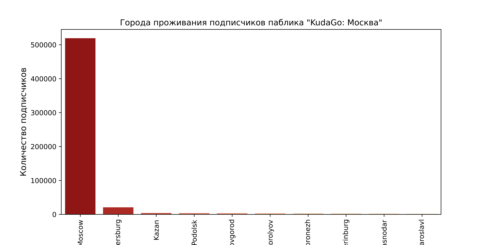

# __Сравнительный анализ пабликов, посвященных достопримечательностям и развлечениям Москвы и Санкт-Петербурга.__

## _Над проектом работали: Милова Анастасия, Повстьева Карина_

Файл с кодом находится [тут](Project.ipynb).

### __Задачи проекта:__

1. _Найти существующие в вк паблики, посвященные достопримечательностям и развлечениям в Москве и Санкт-Петербурге._
2. _Выбрать 2 наиболее значимых паблика по Москве и Санкт-Петербургу._
3. _Определить распределение по возрасту и полу подписчиков каждого паблика._
4. _Определить наиболее распространённые города проживания подписчиков каждого паблика._
5. _Сравнить распространённость городов проживания подписчиков пабликов._
6. _Выявить наличие и количество людей, состоящих в обоих пабликах._
7. _Определить, жители каких городов являются подписчиками обоих пабликов._
8. _Выявить наиболее часто встречающиеся в постах пабликов достопримечательности, локации, персоны и их пересечения._

Работу над проектом мы начали с выгрузки групп социальной сети "ВКонтакте", посвященных достопримечательностям и развлечениям в Москве и Санкт-Петербурге, по идентичным ключевым словам для каждого города ("Куда пойти в Москве/Санкт-Петербурге", "Интересные места Москвы/Санкт-Петербурга", "Экскурсии по Москве/Санкт-Петербургу", "События в Москве/Санкт-Петербурге"). В результате количество таких групп по [Санкт-Петербургу](files/saved_groups_spb.tsv) (602) значительно превысил количество групп по [Москве](files/saved_groups_spb.tsv) (218).

Переходим к более подробному анализу на примере конкретных пабликов. Для исследования нами были выбраны популярные паблики ["KudaGo: Москва"](https://vk.com/kudago) (1074738 подписчиков) и ["KudaGo: Санкт-Петербург"](https://vk.com/kudagospb) (650417 подписчиков). То, что данные паблики являются однотипными, гарантирует наиболее схожую тематику и формат постов, что позволяет выявить при анализе более точные закономерности, связи и различия.

Мы начали анализ с исследования демографических характеристик (пола, возраста) подписчиков каждого паблика. Мы поистроили графики, демонстрирующие возрастное и гендерное распределение в каждом паблике. 

По данным графикам видно, что значимых различий в демографически характеристиках подписчиков пабликов не наблюдается. В среднем количество подписчиков женского пола заметно превышает количество подписчиков мужского пола. Средний возраст подписчиков - от 20 до 35 лет (1985 - 2000 годы рождения).

Далее нами были определены наиболее распространённые города проживания подписчиков каждого паблика. Были построены графики, отображающие 10 наиболее распространённых городов проживания подписчиков паблика "KudaGo: Москва" и "KudaGo: Санкт-Петербург".

Как мы видим, подавляющее большинство подписчиков проживает в том городе, развлечениям и достопримечательностям которого посвящён паблик. При этом важно отметить, что у паблика "KudaGo: Москва" подписчиков из Санкт-Петербурга больше, чем из других городов, а у паблика "KudaGo: Санкт-Петербург" - подписчиков из Москвы. Различаются и остальные города из топ-10 самых распространённых, что может объясняться их географическим положением и близостью к Москве или Санкт-Петербургу соответственно. Важным является и тот факт, что в паблике "KudaGo: Санкт-Петербург" доля подписчиков, проживающих в Москве, выше, чем доля подписчиков из Санкт-Петербурга в паблике "KudaGo: Москва". Это может свидетельствовать о том, что москвичи больше интересуются посещением Северной столицы, чем жители Санкт-Петербурга - досугом в Москве.

Мы предположили, что существуют люди, которые подписаны на оба паблика. Анализ показал, что количество общих участников составляет 54692 человек. Далее нами был построен график, отображающий топ-10 самых распространённых городов проживания этих подписчиков. 

Очевидно, что большинство людей, подписанных на оба паблика, проживают в Москве и Санкт-Петербурге. При этом количество подписчиков из Москвы заметно превышает количество подписчиков из Санкт-Петербурга.

Переходим к анализу постов пабликов. Мы выгрузили последние 25100 постов пабликов ["KudaGo: Москва"](files/posts_msk) и ["KudaGo: Санкт-Петербург"](files/posts_spb). (Такое количество выгруженных постов обусловлено в основном тем, что выгрузка большего количества постов и их последующая обработка оказалась невыполнимой, при этом, как нам кажется, такого количества постов достаточно для того, чтобы выявить общие закономерности). Затем мы провели обработку, лемматизацию и анализ текстов постов:

* с помощью регулярных выражений очистили тексты от ссылок, отметок пользователей и групп, переводов строк;

* токенизировали текст;
  
* очистили тексты от ненужных слов при помощи списка [стоп-слов](files/stopwords_russian.txt);

* создали список самых частых слов очищенных и лемматизированных постов:

     * 
     * 
     
Наиболее часто встречаемые слова постов обоих пабликов отражают их тематику - досуг и развлечения в Москве и Санкт-Петербурге. Так, слово "места" встречается 648 раз в постах паблика "KudaGo: Москва" и 554 раза в паблике "KudaGo: Санкт-Петербург", "афиша" - 598 и 760 раз соответственно, "фестиваль" - 520 и 656. Часто встречается указание на город, которому посвящен паблик, и название самого паблика.
     
К сожалению, нам не удалось до конца выполнить эту задачу, потому что код по лемматизации очищенных слов не смог обработать такой большой объём информации. Код в самом файле python мы на всякий случай оставили.

* при помощи библиотеки "natasha" определили самые часто встречающиеся в текстах постов пабликов локации, организации и персоны:

     *    
     
     *  
     
     *  
     
     *  
     
     *  
     
     *  
     
По этим спискам можно заметить, что многие локации, организации и персоны, упоминающиеся в текстах постов обоих пабликов, связаны с тем, достопримечательностям и развлечениям какого города они посвящены. Так, среди локаций паблика "KudaGo: Москва" мы видим московские улицы и районы - например, Арбат, Покровка, Белорусская, среди организаций - ЦПКИО им. Горького, Третьяковскую галерею, Шереметьево, ЖК "Алые паруса". Среди локаций паблика "KudaGo: Санкт-Петербург" - Петергоф, Нева, Александровский парк, среди организаций - Смольный, Подписные издания, Ленэкспо и тд. У категории "персоны" четкое соотношение с тем или иным городом выявить сложнее, предположим, что они будут часто присутствовать в обоих пабликах. У подавляющего большинства локаций, организаций и персон видна связь с тематикой досуга, развлечений и достопримечательностей - упомянуты певцы, актёры, музеи, театры, парки, а также места проведения выставок, концертов и других развлекательных мероприятий.
     
* определили, есть ли локации, организации и персоны, которые встречаются в текстах двух пабликов, выявили, какие:

     *  
     
     *  
     
     *  

Нами было выявлено 74 локации, 109 организаций и 67 персон, которые были упомянуты в постах обоих пабликов. Большинство являются международными или общероссийскими. Например, зарубежные страны или города, государственные или иностранные организации (YouTube, ВЦИОМ, РЖД), известные во всем мире или по крайней мере на всей территории России деятели искусства (Кристофер Нолан, Сальвадор Дали, Цой). 

### __Выводы:__

1. По результатам анализа двух пабликов было выявлено, что демографические характеристики подписчиков пабликов практически совпадают - подавляющее большинство из них являются представителями женского пола в возрасте от 20 до 35 лет, проживающими в городе, которому посвящён анализируемый паблик (соответственно, Москва или Санкт-Петербург). При этом в группе "KudaGo: Москва" количество подписчиков из Санкт-Петербурга занимает второе место, аналогичное распределение присутствует и в паблике "KudaGo: Санкт-Петербург". Подписчики из других городов занимают незначительную долю от общего количества участников в обоих пабликах.
2. Анализ выявил наличие людей, подписанных на оба паблика. Большинство из них - жители Москвы и Санкт-Петербурга.
3. Наиболее актуальной тематикой для обоих пабликов являются развлечения и достопримечательности в Москве и Санкт-Петербурге, самые часто встречающиеся в постах пабликов слова во многом совпадают. Также совпадают многие локации, организации и персоны. В основном, они относятся к международному или общероссийскому контексту. Упомянуты зарубежные локации, организации и деятели искусства.
